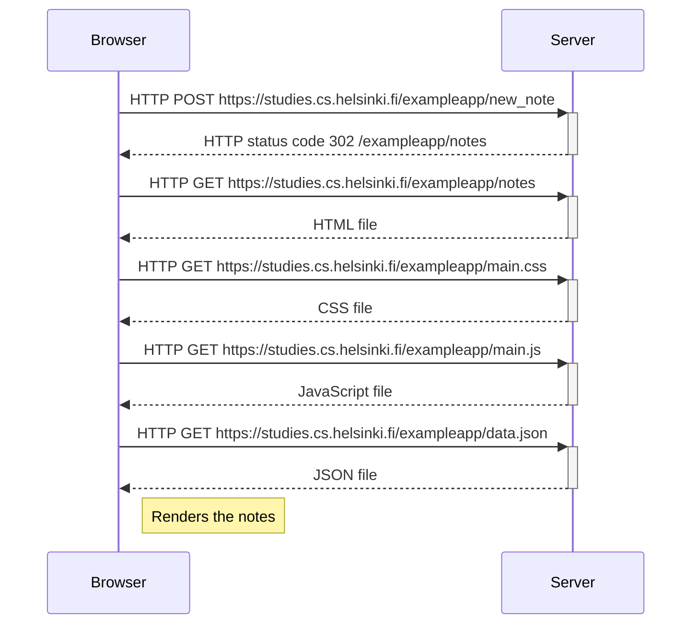

```mermaid
sequenceDiagram
    participant Browser
    participant Server
    Browser->>+Server: HTTP POST https://studies.cs.helsinki.fi/exampleapp/new_note
    Server-->>-Browser: HTTP status code 302 /exampleapp/notes
    Browser->>+Server: HTTP GET https://studies.cs.helsinki.fi/exampleapp/notes
    Server-->>-Browser: HTML file
    Browser->>+Server: HTTP GET https://studies.cs.helsinki.fi/exampleapp/main.css
    Server-->>-Browser: CSS file
    Browser->>+Server: HTTP GET https://studies.cs.helsinki.fi/exampleapp/main.js
    Server-->>-Browser: JavaScript file
    Browser->>+Server: HTTP GET https://studies.cs.helsinki.fi/exampleapp/data.json
    Server-->>-Browser: JSON file
    Note right of Browser: Renders the notes
```   

 